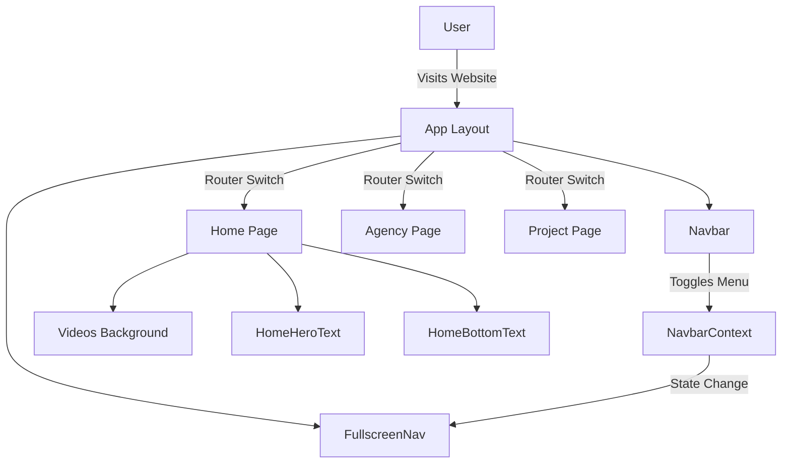
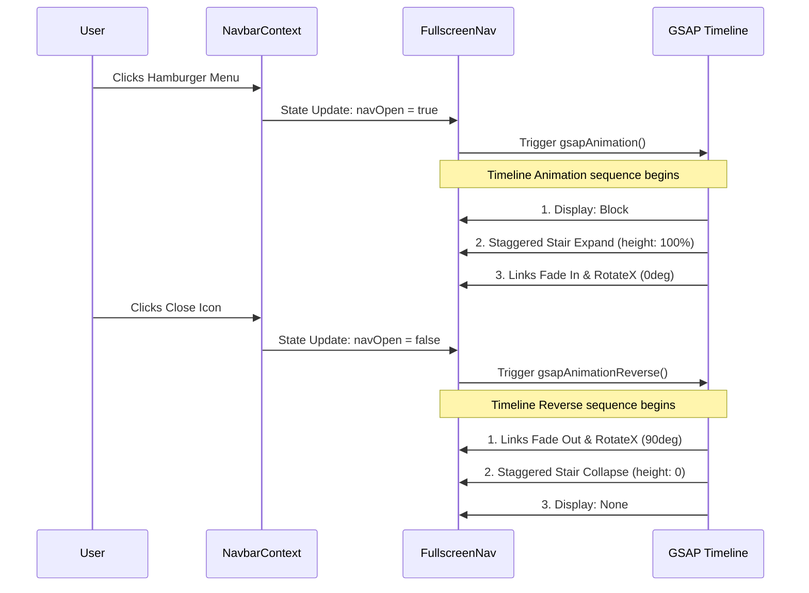

# K72 - Animated React Website

A highly interactive and visually engaging website built with React, Vite, and Tailwind CSS. This project leverages the power of GSAP (GreenSock Animation Platform) to deliver smooth, high-performance animations, including dynamic full-screen navigation with staggered effects, smooth scrolling, and dynamic hover interactions.

## 🌐 Live Demo

https://kk-72.netlify.app/

---

# 🚀 Features

- High-Performance Animations powered by GSAP and `@gsap/react`
- Dynamic Fullscreen Navigation with staggered "stair" reveals
- 3D rotating navigation links
- Modern SPA routing using React Router DOM
- Responsive UI using Tailwind CSS v4
- Lightning-fast Vite build setup
- Interactive UI with video backgrounds and typography animations
- Smooth page transitions and hover interactions

---

# 🛠️ Tech Stack

| Technology | Usage |
|------------|-------|
| React 19 | Frontend Framework |
| Vite | Build Tool |
| Tailwind CSS v4 | Styling |
| React Router DOM 7 | Routing |
| GSAP 3 | Animations |
| @gsap/react | React Animation Integration |

---

# 🏗️ System Architecture & Flow Diagrams

## 1. Application Navigation Flow



---

## 2. GSAP Animation Lifecycle



---

# 📁 Project Structure

```bash
k72/
│
├── public/
│   ├── videos/
│   ├── images/
│   └── favicon.ico
│
├── src/
│   ├── assets/
│   │
│   ├── components/
│   │   ├── Navbar.jsx
│   │   ├── FullscreenNav.jsx
│   │   ├── HomeHeroText.jsx
│   │   ├── HomeBottomText.jsx
│   │   ├── VideoBackground.jsx
│   │   └── AnimatedLink.jsx
│   │
│   ├── context/
│   │   └── NavbarContext.jsx
│   │
│   ├── pages/
│   │   ├── Home.jsx
│   │   ├── Agency.jsx
│   │   └── Project.jsx
│   │
│   ├── routes/
│   │   └── AppRoutes.jsx
│   │
│   ├── App.jsx
│   ├── main.jsx
│   └── index.css
│
├── package.json
├── vite.config.js
├── tailwind.config.js
└── README.md
```

---

# ⚡ GSAP Animation Workflow

## Menu Opening Animation

1. User clicks hamburger icon
2. NavbarContext updates state
3. FullscreenNav component receives update
4. GSAP timeline starts
5. Staggered stairs expand
6. Navigation links rotate and fade in

---

## Menu Closing Animation

1. User clicks close icon
2. State updates to false
3. Reverse timeline starts
4. Links fade out
5. Stairs collapse
6. Menu hidden completely

---

# 🎨 UI/UX Highlights

- Smooth stagger animations
- Interactive typography
- Cinematic video backgrounds
- 3D transform effects
- Responsive mobile-first design
- Smooth transitions between pages
- Minimalistic modern interface

---

# 💻 Running the Project Locally

## Prerequisites

Install Node.js from:

https://nodejs.org/

---

## Installation

### 1. Clone the Repository

```bash
git clone <your-repository-url>
```

### 2. Navigate into the Project Folder

```bash
cd k72
```

### 3. Install Dependencies

```bash
npm install
```

### 4. Start Development Server

```bash
npm run dev
```

---

# 🌍 Open in Browser

Visit:

```bash
http://localhost:5173
```

---

# 📦 Production Build

To generate an optimized production build:

```bash
npm run build
```

The production-ready files will be generated inside the:

```bash
dist/
```

folder.

---

# 🚀 Deployment Platforms

You can deploy the project on:

- Netlify
- Vercel
- Hostinger
- GitHub Pages
- Firebase Hosting

---

# 📈 Performance Optimizations

- Vite optimized bundling
- GPU accelerated animations
- Lazy rendering techniques
- Efficient GSAP timelines
- Tailwind utility optimization
- SPA routing performance improvements

---

# 🔥 Key GSAP Features Used

| Feature | Purpose |
|---------|----------|
| Timeline | Sequencing animations |
| Stagger | Delayed chained animations |
| RotateX | 3D rotation effects |
| Opacity | Fade transitions |
| Scale | Interactive hover effects |
| Transform Origin | Smooth directional animations |

---

# 🧠 Learning Concepts Demonstrated

- React Context API
- Component-based architecture
- Advanced GSAP animations
- Responsive UI design
- SPA routing
- Tailwind CSS workflow
- Animation lifecycle management
- Interactive frontend engineering

---

# 📄 License

This project is open-source and available for learning and personal use.

---

# 👨‍💻 Author

Developed with React, GSAP, and Tailwind CSS.

---

# ⭐ Final Overview

K72 is a modern animated React experience focused on delivering immersive interactions and high-performance frontend animations. The combination of React, GSAP, Vite, and Tailwind CSS creates a fast, visually polished, and scalable frontend architecture suitable for creative portfolios, agency websites, and modern landing pages.
